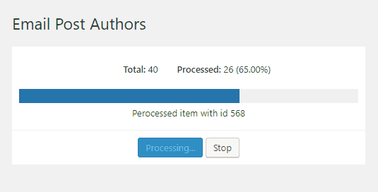

# WP Batch Processing

WP Batch Processing is WordPress plugin for creating batches of data and processing the data items one by one. It allows you to define a batch and to process the queued batch items one by one. There is also option to resume/continue later in case your internet connection goes down.
 


## Installation

1. Install this library as a plugin. It doesn't require anything from below.

2. Or install it as a composer package (read the **notes** bellow)

```
composer require gdarko/wp-batch-processing
```

```php
WP_Batch_Processor::boot();
```

**Note**: The boot() method should be called only if you install the plugin via composer somewhere in your plugin or theme.

**Note**: If you are using composer, the plugin should be able to find its public path, however if you see messed up screen it means that it was unable to find the stylesheet/JS file and you will need to define them manually before including composer's autoload.php file.

```php
if ( ! defined('WP_BP_PATH')) {
    define('WP_BP_PATH', plugin_dir_path(__FILE__));
}

if ( ! defined('WP_BP_URL')) {
    define('WP_BP_URL', plugin_dir_url(__FILE__));
}

// Before this statement.
require_once 'vendor/autoload.php';

```


## How it works

To define a batch you just need to extend the class `WP_Batch` and later register it. Follow  the examples below to learn how.

The class provides the following attributes and methods 

* `$id` - Identifies the batch (must be unique),
* `$title` - Shown in the admin area,
* `setup()` - Method that you use it to fed your data with `WP_Batch_Item` instances,
* `process(WP_Batch_Item $item)` - Method that will be used to process each next item in the batch

```php

if ( class_exists( 'WP_Batch' ) ) {

	/**
	 * Class MY_Example_Batch
	 */
	class MY_Example_Batch extends WP_Batch {

		/**
		 * Unique identifier of each batch
		 * @var string
		 */
		public $id = 'email_post_authors';

		/**
		 * Describe the batch
		 * @var string
		 */
		public $title = 'Email Post Authors';

		/**
		 * To setup the batch data use the push() method to add WP_Batch_Item instances to the queue.
		 *
		 * Note: If the operation of obtaining data is expensive, cache it to avoid slowdowns.
		 *
		 * @return void
		 */
		public function setup() {

			$users = get_users( array(
				'number' => '40',
				'role'   => 'author',
			) );

			foreach ( $users as $user ) {
				$this->push( new WP_Batch_Item( $user->ID, array( 'author_id' => $user->ID ) ) );
			}
		}

		/**
		 * Handles processing of batch item. One at a time.
		 *
		 * In order to work it correctly you must return values as follows:
		 *
		 * - TRUE - If the item was processed successfully.
		 * - WP_Error instance - If there was an error. Add message to display it in the admin area.
		 *
		 * @param WP_Batch_Item $item
		 *
		 * @return bool|\WP_Error
		 */
		public function process( $item ) {

			// Retrieve the custom data
			$author_id = $item->get_value( 'author_id' );

			// Return WP_Error if the item processing failed (In our case we simply skip author with user id 5)
			if ( $author_id == 5 ) {
				return new WP_Error( 302, "Author skipped" );
			}

			// Do the expensive processing here.
			// ...

			// Return true if the item processing is successful.
			return true;
		}
		
		/**
		 * Called when specific process is finished (all items were processed).
		 * This method can be overriden in the process class.
		 * @return void
		 */
		public function finish() {
			// Do something after process is finished.
			// You have $this->items, etc.
		}
	}
}

```

After creating the class, class instance needs to be registered in order to be available in the batches list in the admin area.

```php
/**
 * Initialize the batches.
 */
function wp_batch_processing_init() {
    $batch = new MY_Example_Batch();
    WP_Batch_Processor::get_instance()->register( $batch );
}
add_action( 'wp_batch_processing_init', 'wp_batch_processing_init', 15, 1 );
```

That's it.

## Filters and Actions

Set delay between processing items. Default is 0 (no delay)
```php
function wp_bp_my_custom_delay($delay) {
   return 2; // in seconds
}
add_filter('wp_batch_processing_delay', 'wp_bp_my_custom_delay', 10, 1);
```

## Example use cases

The tool can be used in many different ways. For example

* Importing data
* Downloading data
* Emailing
* Database modifications


## Contribute

If you notice a bug or you want to propose improvements feel free to create a pull request!


## License

The plugin is licensed under GPL v2

```
Copyright (C) 2021 Darko Gjorgjijoski (https://darkog.com)

This file is part of WP Batch Processing

WP Batch Processing is free software: you can redistribute it and/or modify
it under the terms of the GNU General Public License as published by
the Free Software Foundation, either version 2 of the License, or
(at your option) any later version.

WP Batch Processing is distributed in the hope that it will be useful,
but WITHOUT ANY WARRANTY; without even the implied warranty of
MERCHANTABILITY or FITNESS FOR A PARTICULAR PURPOSE.  See the
GNU General Public License for more details.

You should have received a copy of the GNU General Public License
along with WP Batch Processing. If not, see <https://www.gnu.org/licenses/>.
```
